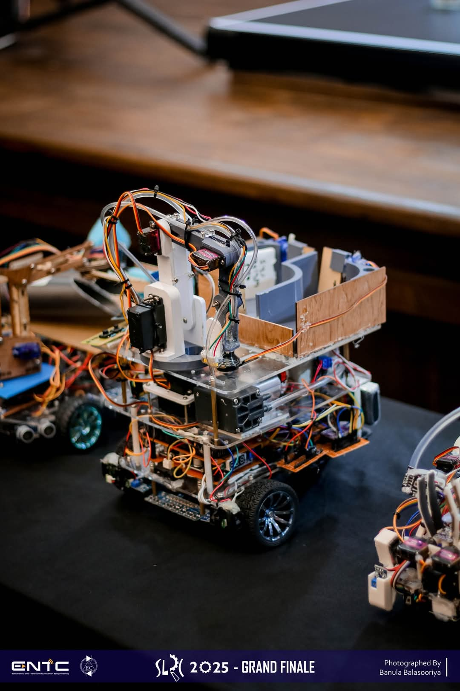
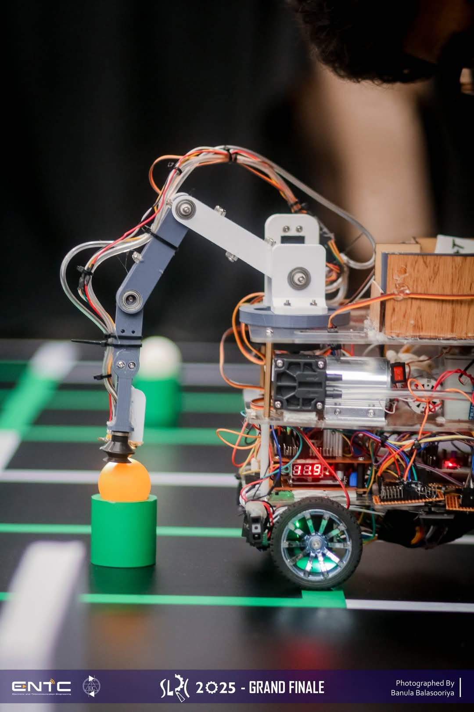
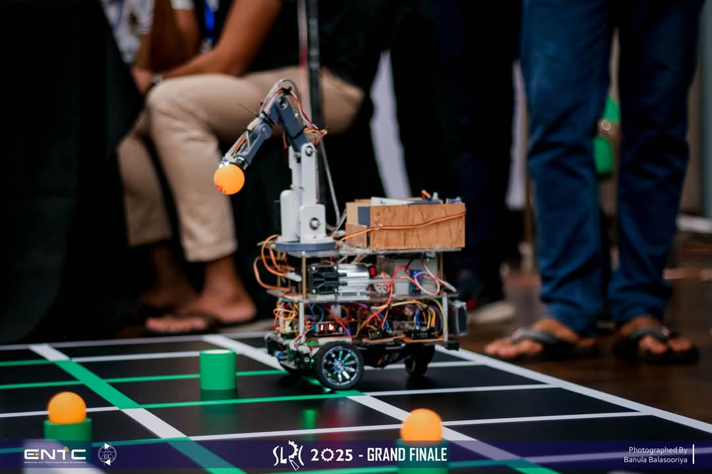
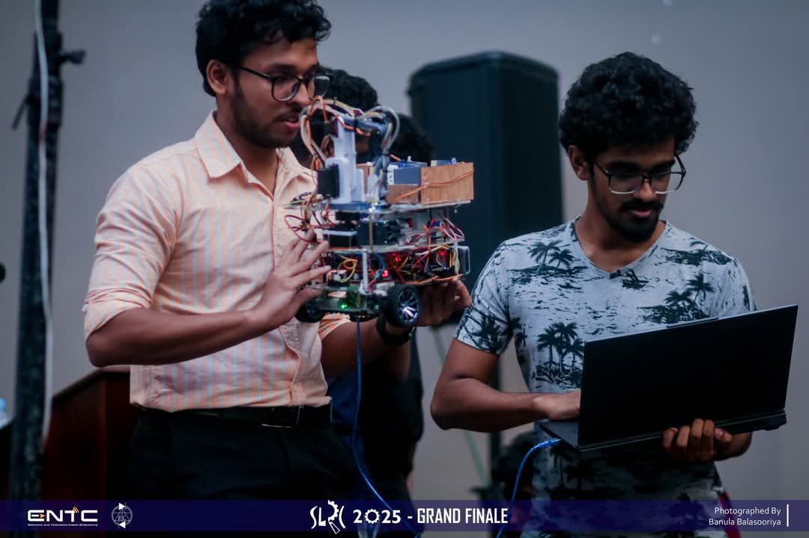
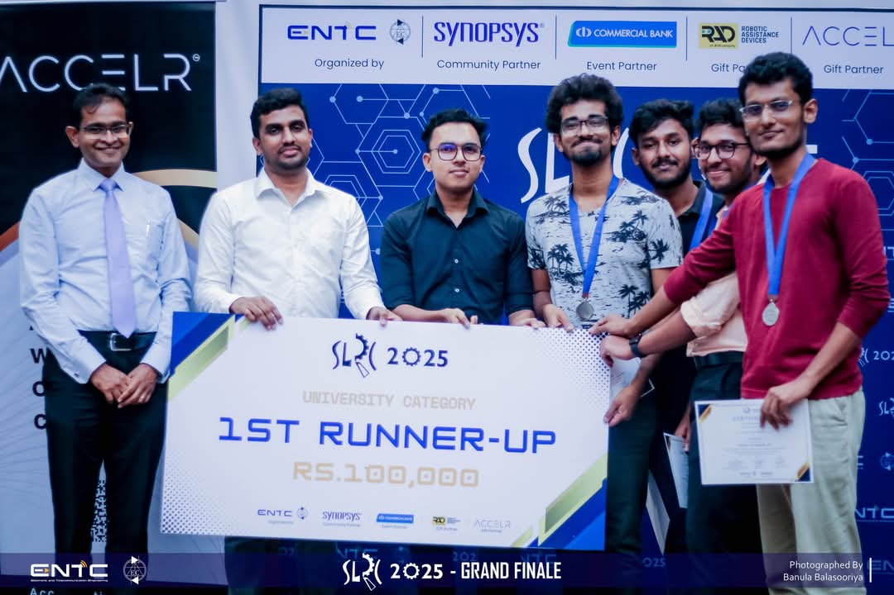

# 🤖 SLRC Vision-Based Autonomous Robot (1st Runner-up)

This repository contains the design and codebase of our autonomous robot, developed for the **Sri Lankan Robotics Challenge (SLRC)**. Our robot was powered by a ** STM32 microcontroller and Raspberry Pi**, and it earned **1st Runner-up** in the national university category.

---

## 📸 Preview

<table>
  <tr>
    <td>
   
  <em>Figure 1: Final robot design for SLRC 2024</em></td>
    <td>
   
  <em>Figure 2: Color Detection using Robot Arm</em></td>
  </tr>
</table>

  
   
  <em>Figure 3: Picking Balls using Robot Arm</em>

  
   
  <em>Figure 4: Progrmming the hidden task</em>

  
   
  <em>Figure 5: Awarding Ceramony</em>

---

## 🚀 Key Features

- 🔧 Real-time control with **STM32 microcontroller**
- 🎯 Vision-based object tracking using **OpenCV** - For Elimination Round only
- 🔁 PID-based motor control
- 🧠 Modular software structure (Python + Embedded C)
- 🖥️ UART-based communication between Pi and STM32

---

## 🛠️ Hardware Components

| Component         | Description                           |
|------------------|---------------------------------------|
| Raspberry Pi      | High-level processing (vision, logic) |
| STM32 MCU         | Low-level motor control               |
| Motor Drivers     | L298N Dual H-Bridge                   |
| Camera Module     | Raspberry Pi Camera Module v2         |
| Chassis & Motors  | Custom-built 2WD platform             |
| Power Supply      | 11.1V LiPo Battery                    |

---

  
📅 **Last Updated - Codes:** `[06-04-2025]`
📅 **Last Updated - Designs:** `[06-04-2025]`
